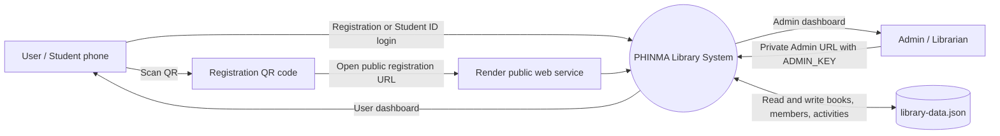
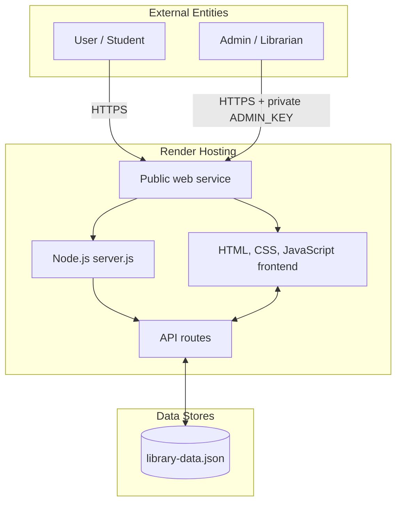
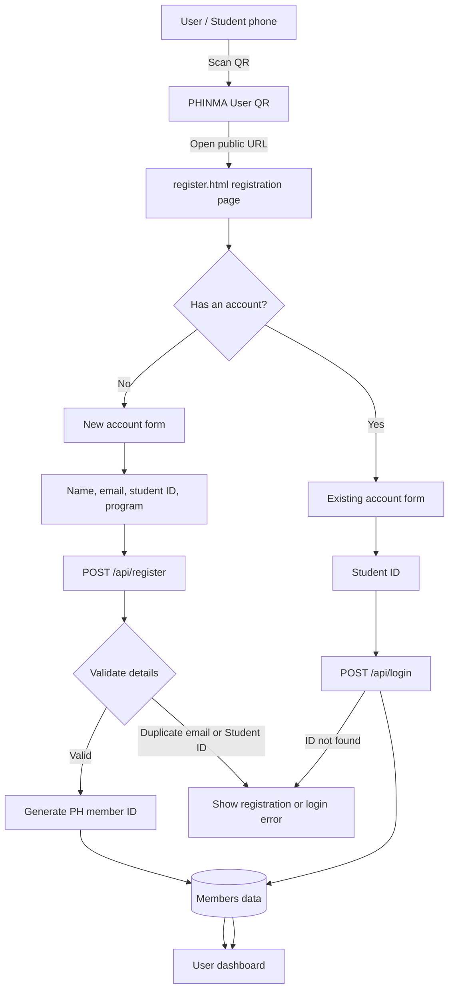
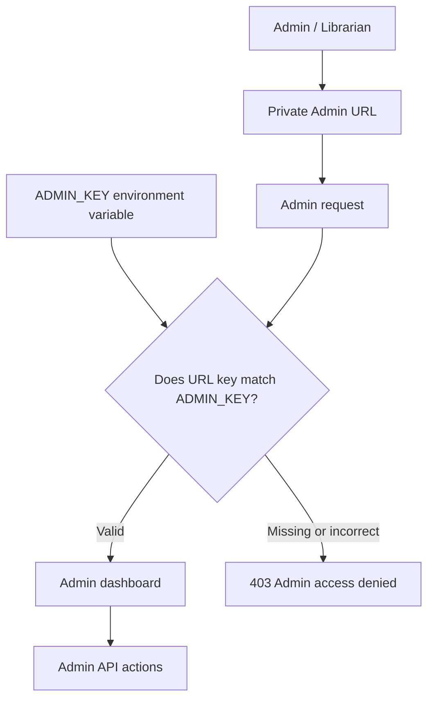
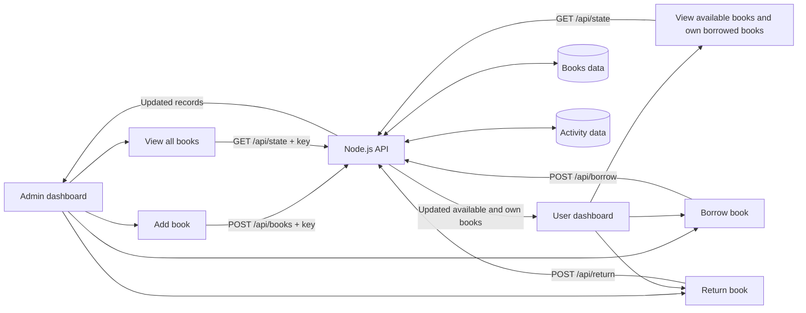
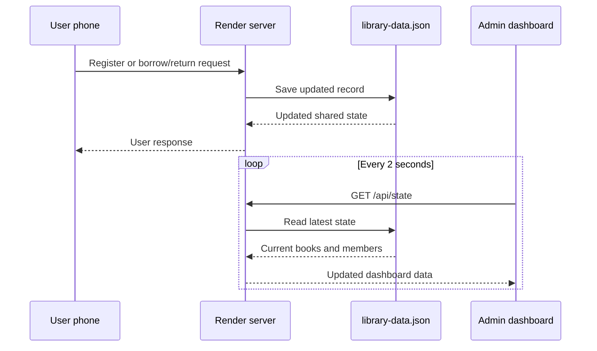
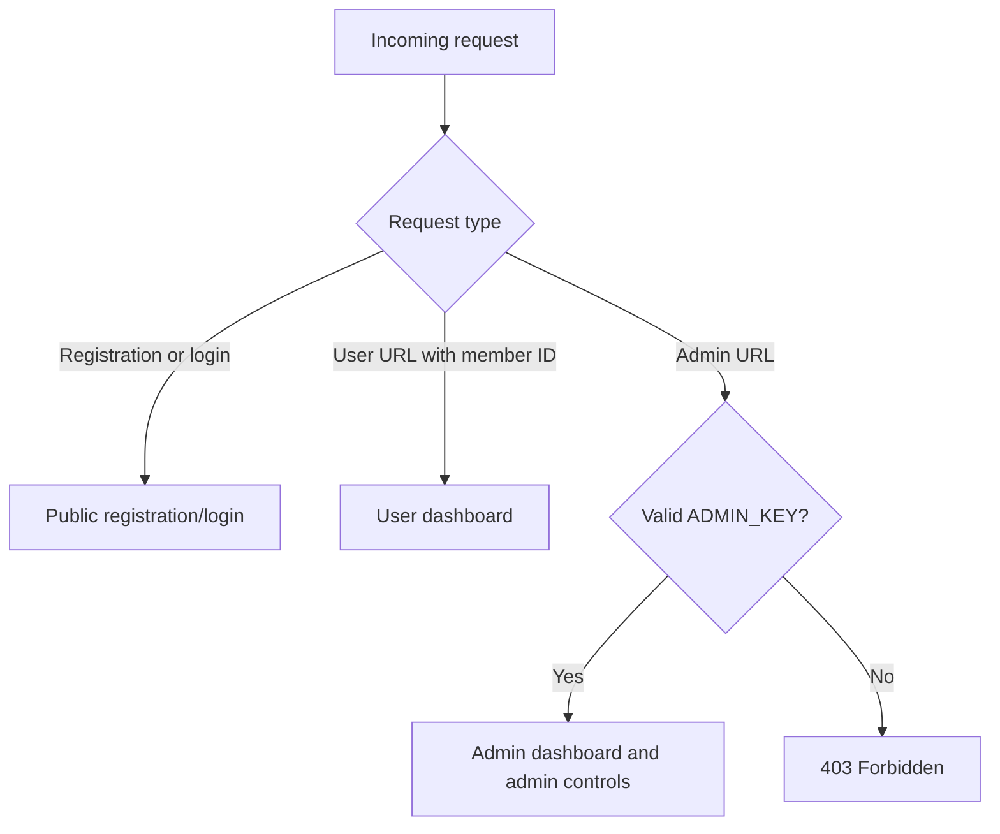

# PHINMA Library Complete Data Flow Diagram

## System Scope

The PHINMA Library is a web-based library system hosted on Render. It has two access paths:

- **User path:** registration QR -> registration/login page -> User dashboard
- **Admin path:** private Admin URL with `ADMIN_KEY` -> Admin dashboard

The application is served by `server.js` and uses the shared `library-data.json` data file.

## Context Diagram: Level 0

## System Boundary

## Level 1: User Access and Registration

## Level 1: Admin Access

## Level 1: Catalog and Circulation

## Level 1: Live Synchronization

## Data Stores

| Store | Contents | Read by | Written by |
| --- | --- | --- | --- |
| `library-data.json` | Complete shared application data | Node.js server | Node.js server |
| `books` | Book ID, title, author, borrowed status, borrower ID | Admin and User dashboards | Admin add-book and borrow/return processes |
| `members` | Member ID, name, email, Student ID, program, date joined | Admin dashboard and User login | Registration process |
| `activities` | Add, borrow, and return events | Admin dashboard | Catalog and circulation processes |
| `ADMIN_KEY` | Private Admin access secret | Admin authorization process | Render environment settings |

## API Process Table

| Process | Endpoint | Description | Access |
| --- | --- | --- | --- |
| Load shared state | `GET /api/state` | Returns books, members, and activity records | User and Admin dashboard |
| Register member | `POST /api/register` | Validates details, creates member ID, saves member | Public registration |
| Login member | `POST /api/login` | Finds member by Student ID | Public user login |
| Add book | `POST /api/books?key=...` | Creates a new book record | Admin only |
| Borrow book | `POST /api/borrow` | Marks an available book with borrower ID | User or Admin |
| Return book | `POST /api/return` | Clears borrower ID and marks book available | Owner or Admin |
| Admin page | `GET /index.html?view=admin&key=...` | Serves Admin dashboard after key validation | Admin only |

## Access Rules

## File and Component Mapping

| Component | Responsibility |
| --- | --- |
| `register.html` | Public registration and Student ID login UI |
| `register.js` | Sends register/login requests and redirects to User dashboard |
| `index.html` | Admin and User dashboard UI |
| `app.js` | Renders role-based views, catalog actions, and live refresh |
| `server.js` | HTTP server, API routes, access control, and file serving |
| `library-data.json` | Shared books, members, and activity records |
| `qrcodes/phinma-registration.png` | QR code pointing to public registration page |
| `ADMIN_KEY` | Render secret used to protect Admin access |
| `package.json` | Render start command: `npm start` |

## Complete User Journey

1. User scans the PHINMA registration QR code.
2. User sees the registration/login page, never the Admin dashboard.
3. New user submits name, email, Student ID, and program.
4. Existing user selects the existing-account option and submits Student ID only.
5. The server validates or creates the member record.
6. The user is redirected to the User dashboard.
7. The User dashboard shows available books and that user's borrowed books.
8. Borrow or return actions update the shared server data.
9. The Admin dashboard receives the updated records through live refresh.

## Complete Admin Journey

1. Admin opens the private URL containing the Render `ADMIN_KEY`.
2. The server compares the URL key with the Render environment variable.
3. Invalid or missing keys receive `403 Forbidden`.
4. Valid Admin access opens the full Admin dashboard.
5. Admin can view all books, member records, activity, and circulation status.
6. Admin can add books and manage circulation records.
7. User registration and borrowing updates are reflected on the Admin dashboard.
