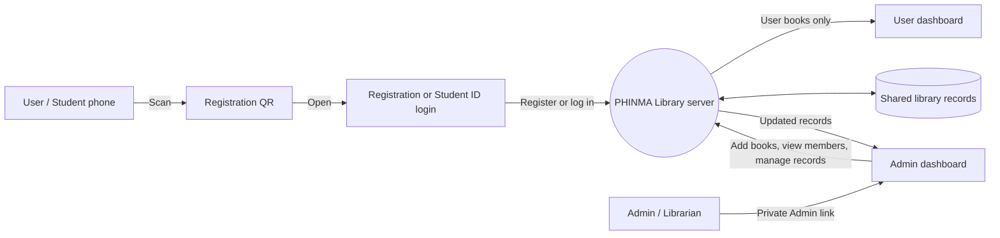
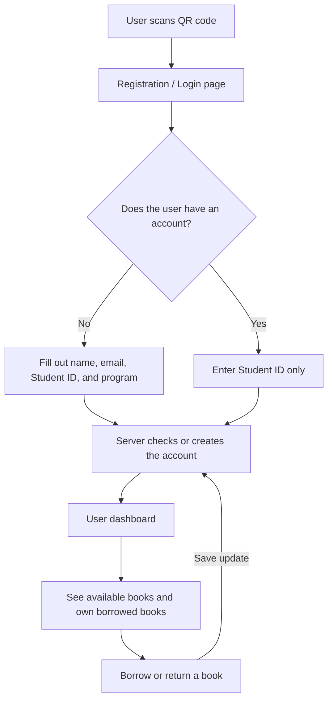
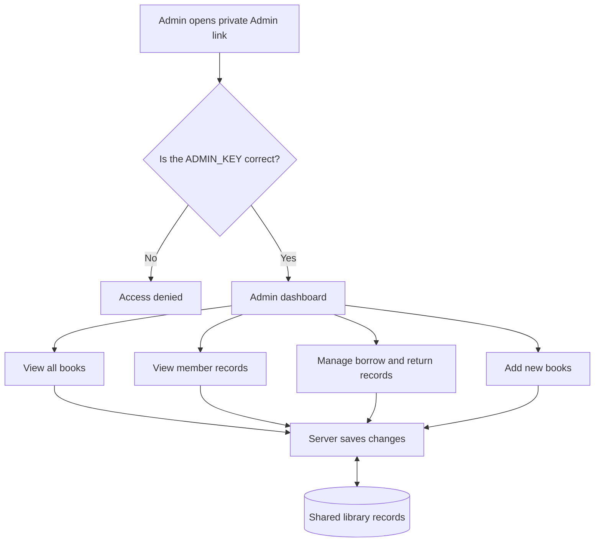

# PHINMA Library: User and Admin Data Flow

## Simple Overview

## User Flow

## Admin Flow

## Difference Between User and Admin

| User | Admin |
| --- | --- |
| Enters through the QR code | Uses a private Admin link |
| Registers or logs in using Student ID | Uses the `ADMIN_KEY` for access |
| Sees available books | Sees the entire catalog |
| Sees only their own borrowed books | Sees all borrowed books and borrowers |
| Can borrow an available book | Can add books and manage records |
| Can return their own borrowed book | Can manage any book transaction |

## Simple Presentation Explanation

> The User scans the QR code and is sent to the registration or login page. A new User fills out the registration form, while an existing User only enters a Student ID. After logging in, the User sees the User dashboard with available books and their own borrowed books.
>
> The Admin has a separate private link protected by an `ADMIN_KEY`. The Admin dashboard shows all books, members, and activities. The User and Admin dashboards use the same server and shared records, so changes in registration, borrowing, and returning are updated in the system.
